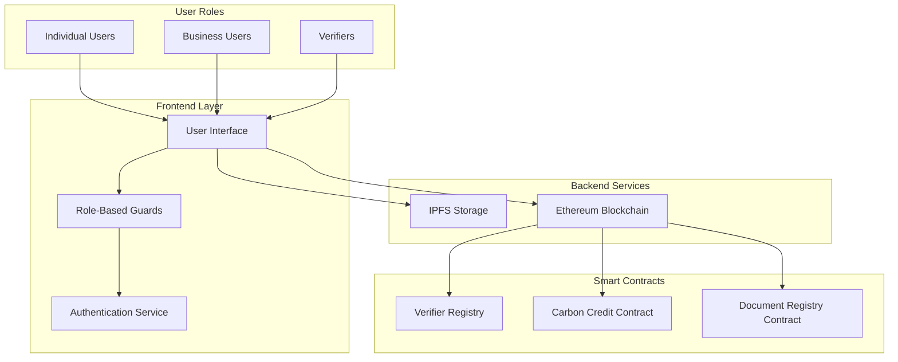
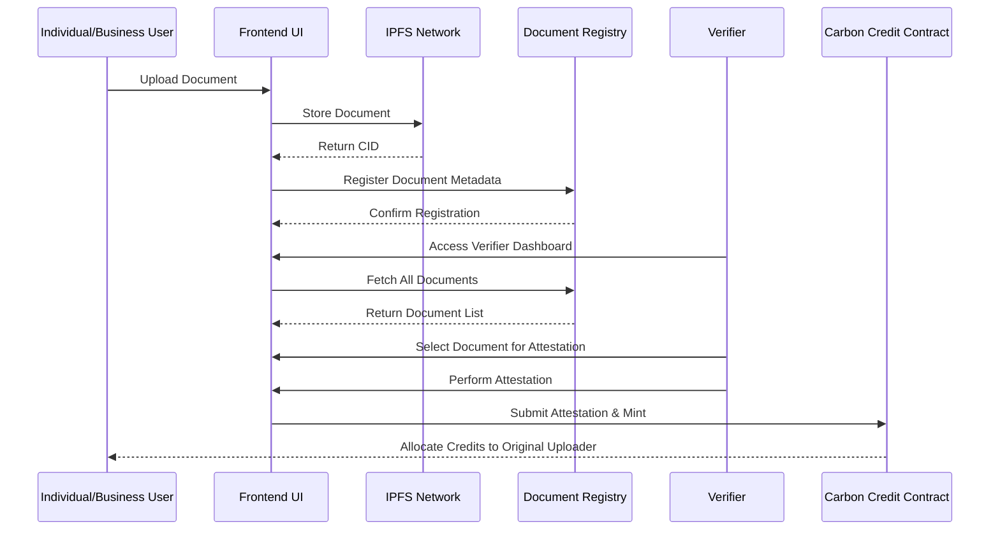

# Design Document

## Overview

This design implements a role-based document verification system that extends the existing CBlock carbon credit platform. The system introduces three distinct user roles with specific permissions: Individual users, Business users, and Verifiers. The design leverages the existing Web3Auth authentication, IPFS storage, and smart contract infrastructure while adding role-based access controls and a new verifier workflow.

The system separates document upload capabilities from verification and minting functions, ensuring that only authorized verifiers can perform attestations and mint carbon credits. This creates a secure, auditable workflow that maintains the integrity of the carbon credit verification process.

## Architecture

### High-Level Architecture



### Role-Based Access Control

The system implements a three-tier role structure:

1. **Individual Users**: Can upload documents only
2. **Business Users**: Can upload documents only
3. **Verifiers**: Can view all documents, perform attestations, and mint credits

### Data Flow



## Components and Interfaces

### Frontend Components

#### 1. Role-Based Route Guards

```javascript
// RoleGuard Component
const RoleGuard = ({ allowedRoles, children, user }) => {
  if (!user || !allowedRoles.includes(user.accountType)) {
    return <AccessDenied />;
  }
  return children;
};
```

#### 2. Enhanced Mint Credits Page

- **Individual/Business View**: Document upload interface only
- **Verifier View**: Redirect to Verifier Dashboard
- Role-specific UI rendering based on `user.accountType`

#### 3. New Verifier Dashboard Component

```javascript
// VerifierDashboard Component Structure
const VerifierDashboard = () => {
  // Document list with filtering and search
  // Attestation workflow interface
  // Minting controls
  // Credit allocation tracking
};
```

#### 4. Document Upload Component Enhancement

```javascript
// Enhanced Upload Component
const DocumentUpload = ({ userRole, onUploadComplete }) => {
  // IPFS upload functionality
  // Metadata collection
  // Progress tracking
  // Role-specific validation
};
```

### Backend Services

#### 1. Enhanced Authentication Service

```javascript
// Extended AuthService with role management
class AuthService {
  // Existing methods...

  getUserRole() {
    return this.currentUser?.accountType || "individual";
  }

  hasPermission(action) {
    const role = this.getUserRole();
    return ROLE_PERMISSIONS[role]?.includes(action) || false;
  }

  isVerifier() {
    return this.getUserRole() === "verifier";
  }
}
```

#### 2. Document Management Service

```javascript
// New DocumentService
class DocumentService {
  async uploadDocument(file, metadata, userAddress) {
    // Upload to IPFS
    // Register in smart contract
    // Associate with user
  }

  async getDocumentsForVerifier() {
    // Fetch all pending documents
    // Return with user association
  }

  async attestDocument(documentId, attestationData, verifierAddress) {
    // Create EIP-712 signature
    // Submit attestation
  }
}
```

#### 3. Blockchain Service Extensions

```javascript
// Extended BlockchainService
class BlockchainService {
  // Existing methods...

  async registerDocument(cid, metadata, userAddress) {
    // Register document in DocumentRegistry contract
  }

  async getAllDocuments() {
    // Fetch all registered documents
  }

  async mintWithAttestation(attestationData, recipientAddress) {
    // Mint credits to original uploader
  }
}
```

## Data Models

### User Model Extension

```javascript
// Extended User Model
const UserModel = {
  id: String,
  email: String,
  firstName: String,
  lastName: String,
  organization: String,
  accountType: "individual" | "business" | "verifier", // New field
  walletAddress: String,
  isVerified: Boolean,
  verifierCredentials: {
    // New field for verifiers
    certificationId: String,
    issuingAuthority: String,
    validUntil: Date,
  },
  createdAt: Date,
  updatedAt: Date,
};
```

### Document Model

```javascript
// New Document Model
const DocumentModel = {
  id: String,
  cid: String, // IPFS Content Identifier
  filename: String,
  fileSize: Number,
  mimeType: String,
  uploadedBy: String, // User address
  uploaderType: "individual" | "business",
  projectName: String,
  projectType: String,
  description: String,
  location: String,
  estimatedCredits: Number,
  status: "pending" | "attested" | "minted" | "rejected",
  attestation: {
    verifierAddress: String,
    attestedAt: Date,
    signature: String,
    gsProjectId: String,
    gsSerial: String,
  },
  mintingResult: {
    tokenId: Number,
    amount: Number,
    transactionHash: String,
    mintedAt: Date,
  },
  createdAt: Date,
  updatedAt: Date,
};
```

### Attestation Model

```javascript
// EIP-712 Attestation Structure
const AttestationModel = {
  gsProjectId: String,
  gsSerial: String,
  ipfsCid: String,
  amount: Number,
  recipient: String, // Original uploader address
  nonce: Number,
};
```

## Smart Contract Extensions

### 1. New DocumentRegistry Contract

```solidity
// DocumentRegistry.sol
contract DocumentRegistry {
    struct Document {
        string cid;
        address uploader;
        string projectName;
        uint256 estimatedCredits;
        uint256 timestamp;
        bool isAttested;
        address verifier;
    }

    mapping(uint256 => Document) public documents;
    mapping(address => uint256[]) public userDocuments;
    uint256 public nextDocumentId;

    event DocumentRegistered(uint256 indexed documentId, address indexed uploader, string cid);
    event DocumentAttested(uint256 indexed documentId, address indexed verifier);

    function registerDocument(
        string calldata cid,
        string calldata projectName,
        uint256 estimatedCredits
    ) external returns (uint256);

    function attestDocument(uint256 documentId) external;

    function getAllDocuments() external view returns (Document[] memory);

    function getUserDocuments(address user) external view returns (uint256[] memory);
}
```

### 2. Enhanced CarbonCredit Contract

The existing contract already supports the required functionality with `mintWithAttestation`. We'll extend it to track document associations:

```solidity
// Additional mapping in CarbonCredit.sol
mapping(uint256 => uint256) public tokenToDocument; // tokenId => documentId

// Enhanced mintWithAttestation to include document tracking
function mintWithAttestationAndDocument(
    string calldata gsProjectId,
    string calldata gsSerial,
    string calldata ipfsCid,
    uint256 amount,
    address recipient,
    uint256 documentId,
    bytes calldata signature
) external {
    // Existing minting logic...
    tokenToDocument[tokenId] = documentId;
}
```

## Error Handling

### Frontend Error Handling

```javascript
// Centralized error handling for role-based operations
const ErrorHandler = {
  handleRoleError(error, userRole) {
    if (error.code === "INSUFFICIENT_PERMISSIONS") {
      return `Your ${userRole} account doesn't have permission for this action`;
    }
    if (error.code === "VERIFIER_REQUIRED") {
      return "This action requires verifier privileges";
    }
    return error.message || "An unexpected error occurred";
  },

  handleUploadError(error) {
    if (error.code === "FILE_TOO_LARGE") {
      return "File size exceeds maximum limit (10MB)";
    }
    if (error.code === "INVALID_FILE_TYPE") {
      return "Please upload a valid document (PDF, DOC, DOCX)";
    }
    return "Failed to upload document. Please try again.";
  },
};
```

### Smart Contract Error Handling

```solidity
// Custom errors for better gas efficiency
error NotVerifier();
error DocumentNotFound();
error DocumentAlreadyAttested();
error InvalidSignature();
error InsufficientPermissions();

// Usage in contract functions
function attestDocument(uint256 documentId) external {
    if (!verifierRegistry.isVerifier(msg.sender)) {
        revert NotVerifier();
    }
    // ... rest of function
}
```

## Testing Strategy

### Unit Tests

#### Frontend Component Tests

```javascript
// RoleGuard.test.jsx
describe("RoleGuard Component", () => {
  test("allows access for authorized roles", () => {
    // Test individual user accessing upload
    // Test verifier accessing dashboard
  });

  test("denies access for unauthorized roles", () => {
    // Test individual user accessing verifier dashboard
    // Test verifier accessing upload (should redirect)
  });
});

// VerifierDashboard.test.jsx
describe("VerifierDashboard Component", () => {
  test("displays all uploaded documents", () => {
    // Mock document data
    // Verify rendering
  });

  test("handles attestation workflow", () => {
    // Test attestation process
    // Verify signature generation
  });
});
```

#### Service Tests

```javascript
// DocumentService.test.js
describe("DocumentService", () => {
  test("uploads document to IPFS successfully", async () => {
    // Mock IPFS upload
    // Verify CID generation
  });

  test("registers document in smart contract", async () => {
    // Mock blockchain interaction
    // Verify document registration
  });
});

// AuthService.test.js
describe("AuthService Role Management", () => {
  test("correctly identifies user roles", () => {
    // Test role detection
    // Test permission checking
  });
});
```

### Integration Tests

#### End-to-End Workflow Tests

```javascript
// e2e/document-verification.test.js
describe("Document Verification Workflow", () => {
  test("complete individual user upload to verifier minting flow", async () => {
    // 1. Individual user uploads document
    // 2. Document appears in verifier dashboard
    // 3. Verifier performs attestation
    // 4. Verifier mints credits
    // 5. Credits appear in individual user account
  });

  test("business user upload and verification", async () => {
    // Similar flow for business users
  });
});
```

#### Smart Contract Integration Tests

```javascript
// test/DocumentRegistry.test.js
describe("DocumentRegistry Contract", () => {
  test("registers documents correctly", async () => {
    // Test document registration
    // Verify event emission
  });

  test("only allows verifiers to attest", async () => {
    // Test access control
    // Verify revert for non-verifiers
  });
});
```

### Performance Tests

```javascript
// performance/upload.test.js
describe("Document Upload Performance", () => {
  test("handles large file uploads efficiently", async () => {
    // Test with various file sizes
    // Measure upload times
  });

  test("dashboard loads quickly with many documents", async () => {
    // Test with 100+ documents
    // Verify pagination performance
  });
});
```

### Security Tests

```javascript
// security/role-access.test.js
describe("Role-Based Security", () => {
  test("prevents privilege escalation", async () => {
    // Test role manipulation attempts
    // Verify access controls
  });

  test("validates attestation signatures", async () => {
    // Test signature verification
    // Test replay attack prevention
  });
});
```

## Implementation Considerations

### Role Management

- User roles are stored in the existing `accountType` field
- Default role is 'individual' for backward compatibility
- Verifier role requires manual assignment (admin function)
- Role changes require re-authentication

### IPFS Integration

- Leverage existing IPFS upload functionality
- Add metadata storage for document tracking
- Implement content addressing for document verification
- Consider IPFS pinning for important documents

### Smart Contract Deployment

- Deploy new DocumentRegistry contract
- Update existing contracts if needed
- Maintain backward compatibility
- Implement upgrade patterns for future enhancements

### User Experience

- Seamless role-based navigation
- Clear visual indicators for user roles
- Intuitive verifier workflow
- Real-time status updates for document processing

### Scalability

- Implement pagination for document lists
- Use efficient querying for large datasets
- Consider off-chain indexing for better performance
- Optimize smart contract gas usage

### Security

- Implement proper access controls at all levels
- Validate user permissions on both frontend and backend
- Use secure signature schemes for attestations
- Audit smart contracts for vulnerabilities
